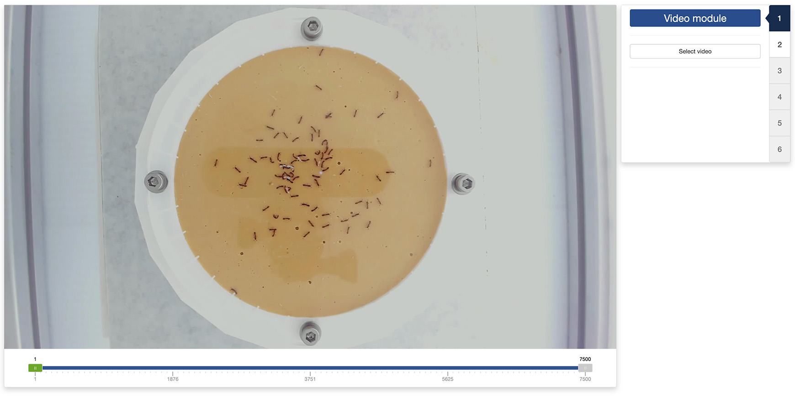
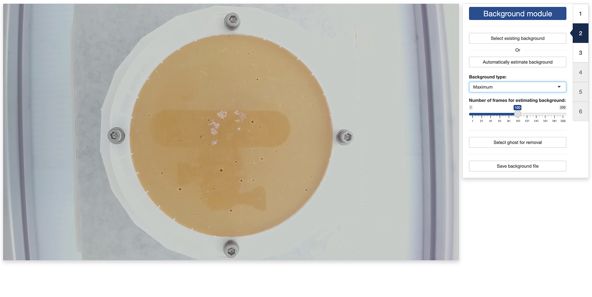
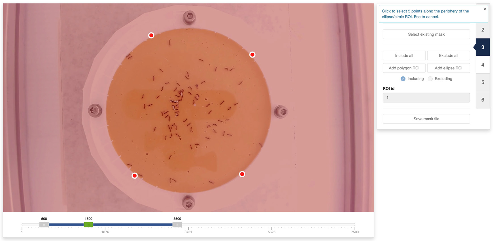
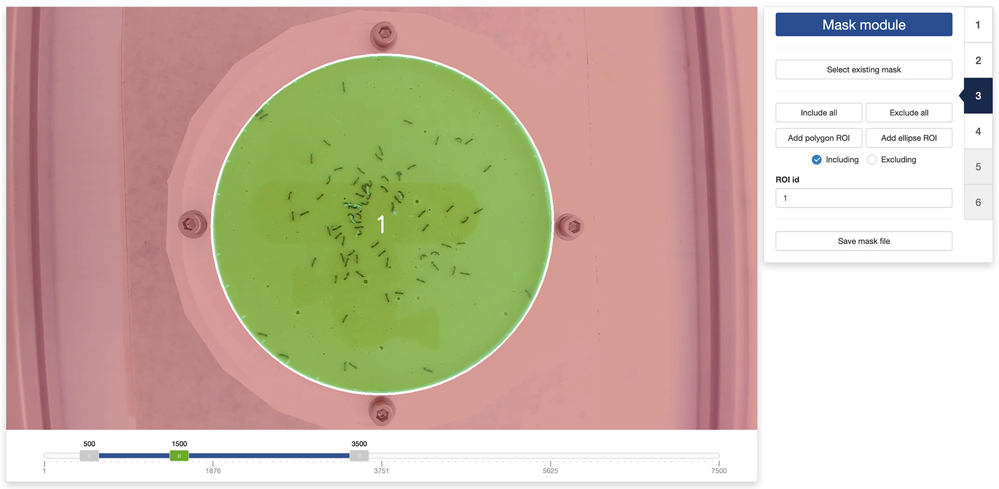
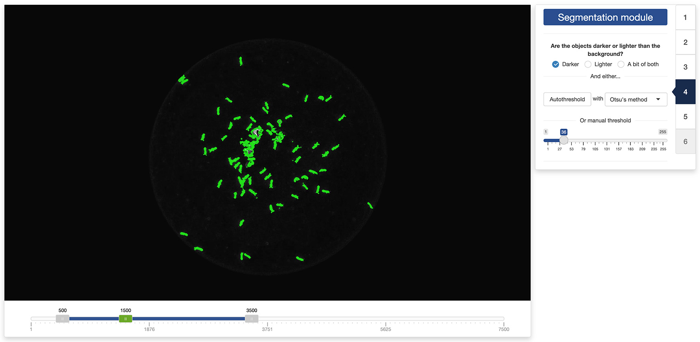
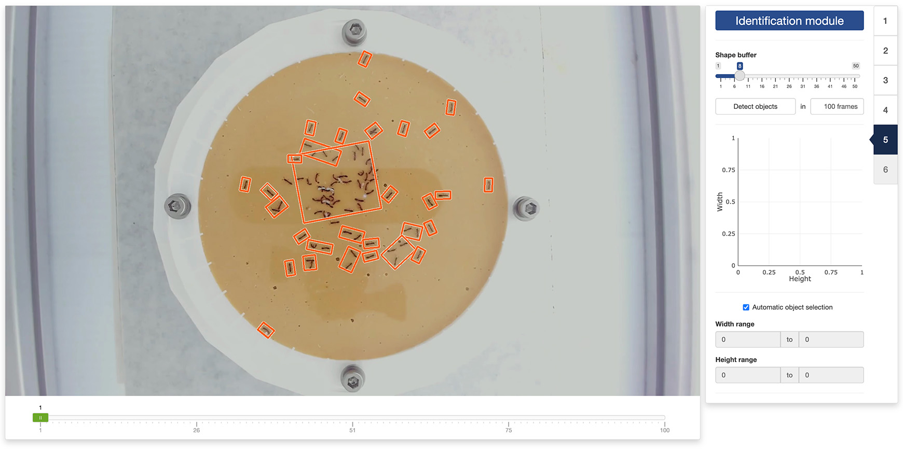
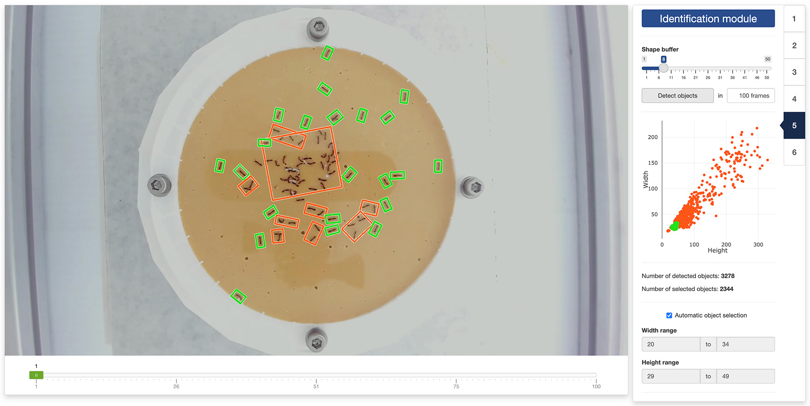
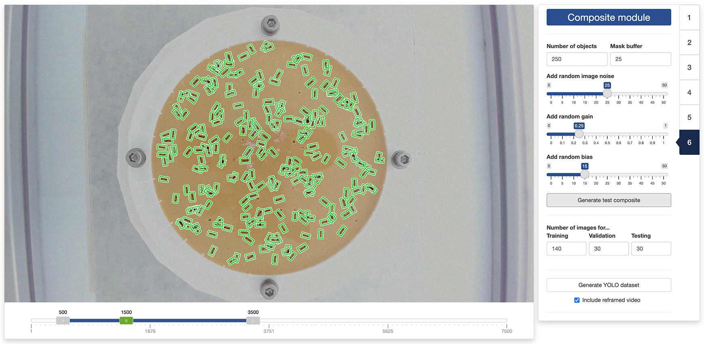

```{r, include = FALSE}
knitr::opts_chunk$set(
  collapse = TRUE,
  comment = "#>"
)
```

# 2.1 - Launch the preparation app

```{r setup}
library(trackRai, eval = FALSE)
prepare()
```

---

# 2.2 - Video module



---

# 2.3 - Background module



---

# 2.4 - Mask module





---

# 2.5 - Segmentation module



---

# 2.6 - Identification module





---

# 2.3 - Composite module



---