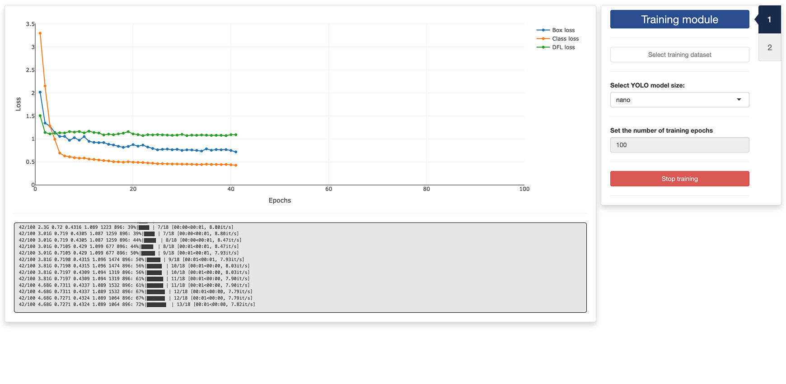
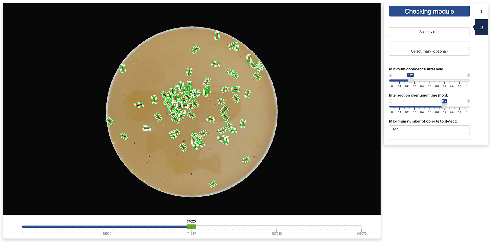

```{r, include = FALSE}
knitr::opts_chunk$set(
  collapse = TRUE,
  comment = "#>"
)
```

In this tutorial, we will discuss how to use the second app provided with 
`trackRai` to train a YOLO11 model using the dataset created in the 
[previous tutorial](https://swarm-lab.github.io/trackRai/articles/z2_prepare.html). 
The process is straightforward, however, it might take some time depending on 
the configuration of your system. A machine with an NVIDIA graphics card and the
CUDA framework installed is highly recommended. 

---

# 3.1 - Launch the training app

To launch the training app, run the following in the R console:

```{r setup, eval = FALSE}
library(trackRai)
train()
```

This will open the app either in the viewer panel of RStudio and Positron, or in
your default internet browser. You can control where the app is opened using the
`launch.browser` parameter (see the documentation of shiny::runApp() for more
information).

---

# 3.2 - Tab 1: training module

Once the app opens, you will be presented with the "Training" tab. Click on the 
`Select training dataset` button and navigate to a folder containing a YOLO
dataset (it should a folder named `YOLO`). Select this folder. 

Then, select a model size. Smaller models take less time and memory to train, 
larger models may yield better results for complex arrangements of objects. We 
find that the smaller ("nano") model size does a really good job in most 
situations. 

Finally, you can set the maximum number of training epochs you would like to run
and the "patience" of the training process. This last paramater allows the 
training to stop automatically if the training performance does not improve 
after a set number of epochs. This helps prevent overfitting by stopping 
training when performance plateaus; it also saves computing time. If you do not
want training to stop early, set the patience to the maximum number of epochs.



After setting all the training parameters, click the `Start training` button and 
wait until it completes. Performance metrics will be displayed in the graph on 
the left of the window, and in the log panel below the graph. 

Once the training has completed successfully, the second tab of the app will 
become available and you can click on it to navigate there. 

---

# 3.3 - Tab 2: checking module

In the second tab of the training app, you can check the quality of the training
and the effect of the inference paramaters on the detection of the objects of 
interest in a video. 

First, you need to select a video by clicking the `Select video` button. You can
also select an optional mask by clicking the `Select mask (optional)` button. 
This will load the video in the app and you can navigate it using the slider 
under the display panel. Detected objects will be automatically enclosed in a 
green rectangle. 



You can check the effect of the following paramters on the quality of the object
detection: 

+ **Minimum confidence threshold:** the minimum confidence threshold for 
 detections. Objects detected with confidence below this threshold will be 
 disregarded. Adjusting this value can help reduce false positives.
+ **Intersection over union threshold:** threshold for non-maximum suppression. 
 Lower values result in fewer detections by eliminating overlapping boxes, 
 which can be useful for reducing duplicates.
+ **Maximum number of objects to detect:** Maximum number of detections allowed 
 per frame. Limits the total number of objects the model can detect in a single 
 inference, preventing excessive outputs in dense scenes.

If you are not satisfied with the detection results, you can return to the first
tab and increase the number of training epochs and the patience of the training,
or select a larger model size, before running another round of training. 

If you are satisfied with the results, you are done and you can close the app. 
The next step will be using the trained model to 
[track objects in a video](https://swarm-lab.github.io/trackRai/articles/z4_track.html).

---