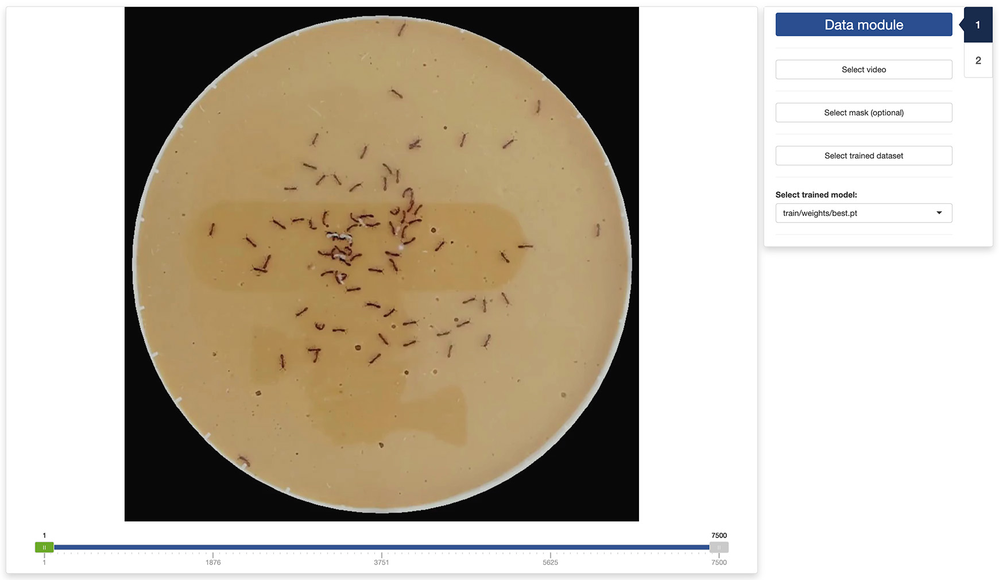
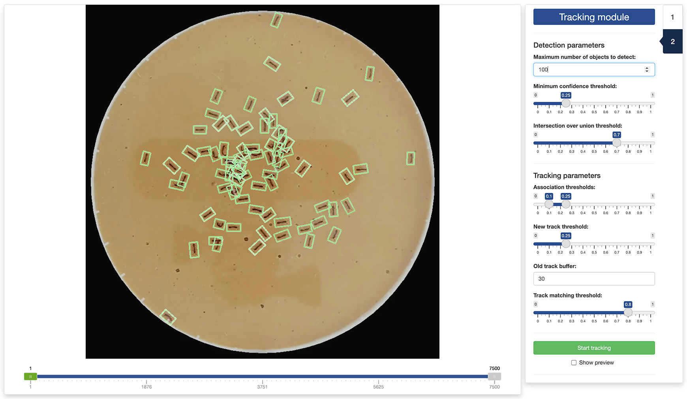
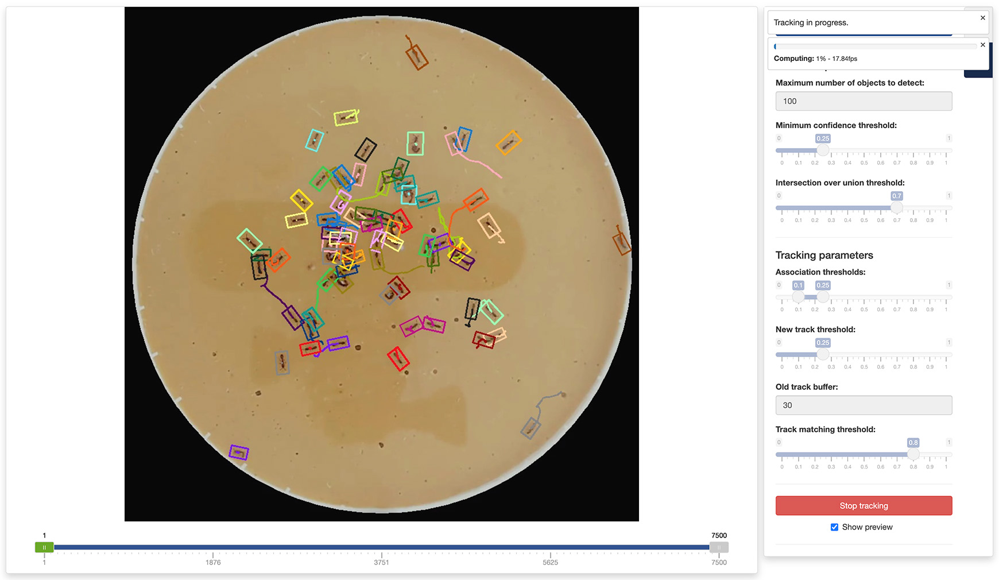

```{r, include = FALSE}
knitr::opts_chunk$set(
  collapse = TRUE,
  comment = "#>"
)
```

# 4.1 - Launch the tracking app

```{r setup, eval = FALSE}
library(trackRai)
track()
```

---

# 4.2 - Data module



---

# 4.3 - Tracking module





---