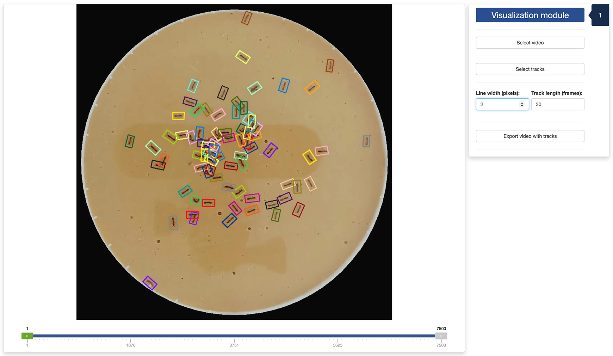

```{r, include = FALSE}
knitr::opts_chunk$set(
  collapse = TRUE,
  comment = "#>"
)
```

In this tutorial, we will discuss how to use the fourth app provided with 
`trackRai` to visualize the output of the tracking app, as explained in the 
[previous tutorial](https://swarm-lab.github.io/trackRai/articles/z4_track.html).

---

# 5.1 - Launch the visualization app

To launch the visualization app, run the following in the R console:

```{r setup, eval = FALSE}
library(trackRai)
visualize()
```

This will open the app either in the viewer panel of RStudio and Positron, or in
your default internet browser. You can control where the app is opened using the
`launch.browser` parameter (see the documentation of shiny::runApp() for more
information).

---

# 5.2 - Tab 1: visualization module

Once the app opens, you will be presented with the "Visualization" tab. First, 
you need to select a video by clicking the `Select video` button. You will also 
select a CSV file containing the tracks obtained using the tracking app by 
clicking the `Select tracks` button. These steps will load the video and tracks 
in the app. You can navigate through the video using the slider under the 
display panel. The slider has three handles: 

+ the green handle allows you to navigate through the video to display a frame 
of your choice; 
+ the two grey handles allow you to restrict the processing of the video to a 
range of frames in the video. This can be convenient when only a portion of the 
video is usable, for instance. 



You can adjust the width of the border of the rectangle enclosing each track 
object. You also adjust the length (in frames) of the track left behind each 
moving object. 

Finally, you can export a video showing the rectangles and tracks by clicking 
the `Export video with tracks` button. This will bring up a file browser where 
you can select where to save the video. 

---